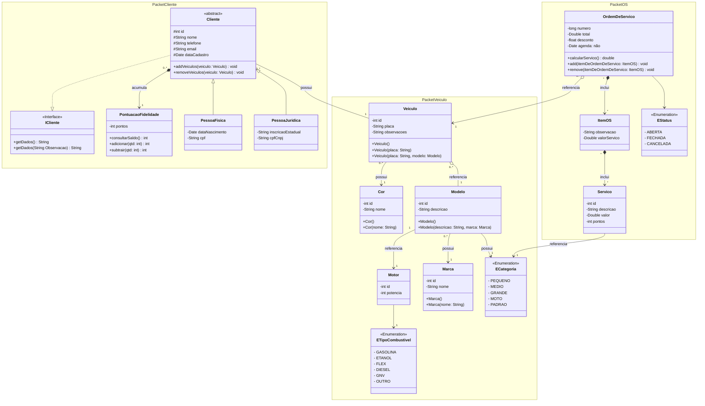

###### #JavaCodes

<h1 align="center"> lavaCode </h1>

## Descrição

## 📱 Projeto Sistema de Controle de Lavação

install4j software para distribuição de aplicativos Java
### Descrição do Projeto

Este projeto tem como objetivo desenvolver um sistema de lavação de carros com funcionalidades abrangentes para o gerenciamento de ordens de serviço, cadastro e gerenciamento de veículos, clientes e serviços, geração de relatórios, e implementação de um sistema de pontuação para um plano de fidelidade.

### Funcionalidades

1. __Controle de Ordens de Serviço (OS)__:
- Criação, atualização e gerenciamento de ordens de serviço.
- Acompanhamento do status das ordens de serviço (ABERTA, FECHADA, CANCELADA).
- Cálculo do valor total do serviço e aplicação de descontos.
2. __Cadastro e Gerenciamento de Veículos, Clientes e Serviços__:
- Cadastro e atualização de informações de clientes (Pessoa Física e Pessoa Jurídica).
- Cadastro e atualização de informações de veículos, incluindo modelo, marca, cor, motor, e tipo de combustível.
- Cadastro de diferentes serviços oferecidos pelo lava a jato, com descrição, valor e pontos de fidelidade associados.
3. __Geração de Relatórios__:
- Relatórios de serviços realizados.
- Relatórios de faturamento.
- Relatórios de pontos acumulados pelos clientes.
4. __Sistema de Pontuação para Plano de Fidelidade__:
- Implementação de um sistema de pontuação onde clientes acumulam pontos com base nos serviços adquiridos.
- Consulta e gerenciamento do saldo de pontos dos clientes.
- Adição e subtração de pontos conforme necessário.

### Diagrama de Classes

<table>
  <tr>
    <td>
      
    </td>
    <td>
      
    </td>
  </tr>
</table>

<!-- [MermaidChart: 3c7d24e8-f066-4729-bf14-ab089cf5979a] -->

<---------------------------------->

# Parte - 2
## Implementação de Herança e Interface

### Como Contribuir

1. Faça um fork deste repositório.
2. Crie um branch para a sua feature (git checkout -b feature/nome-da-feature).
3. Faça commit das suas alterações (git commit -am 'Adiciona nova feature').
4. Faça push para o branch (git push origin feature/nome-da-feature).
5. Crie um novo Pull Request.

Para dúvidas ou sugestões, por favor, entre em contato via email.

# Author

| [ Carlos Hayden](https://github.com/JunhaumHayden) |
| :---: |